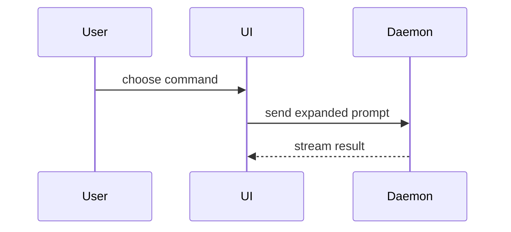

Pick the **smallest view** that makes the key point clear. Keep prose brief.

- Show logic or an algorithm as pseudocode:

```text
on(save)
  if content is unchanged
    return cached result
  write new content
  return fresh result
```

- Show runtime control flow as a call tree:

```text
submitForm
  createSession
    persistPrompt
    launchAgent
  navigateToSession
```

- Show UI structure as a component tree, including state and module boundaries that matter:

```tsx
<SessionPage> (apps/example/src/routes/session.tsx)
  useSessionEvents()
  <SessionToolbar>
    <RunSkillButton> (packages/ui)
```

- Show file responsibility or a broad refactor as a shallow file tree:

```text
src/
├── commands/       # parses user actions
├── sessions/       # owns session state
└── transport/      # sends API requests
```

- Show messages between two or more participants, such as a user, a UI and a service, with Mermaid. A single call path inside one process is a call tree, not a diagram:



Mermaid renders on GitHub and in HTML, not in a terminal reply. In a terminal, draw the same diagram as a `text` fence.

- Use `diff` over any view above when the point is what changes and the surrounding shape already exists. Keep unchanged lines as context so ownership and order stay visible:

```diff
 submitForm
   createSession
     persistPrompt
+    expandSkillMention
     launchAgent
   navigateToSession
+    subscribeToEvents
```

```diff
 src/
 ├── commands/
+│   └── show-me.ts       # expands the slash command
 ├── sessions/
-└── transport.ts
+└── transport/
+    ├── client.ts
+    └── stream.ts
```

- Show the whole block when most of it is new, when omitted context would hide ownership or order, or when the user needs a copyable target shape:

```ts
function expandSkill(command: string): string {
  const skillName = command.slice(1);
  return `use the ${skillName} skill`;
}
```

- For a visual UI, layout, state comparison, or concept too dense for Mermaid, write one focused HTML file in the session's scratch directory, or the system temp directory when there is none: a diagram, an infographic, or a short slide deck, whichever fits the point. Match the product's colors, type, spacing, and components; use real labels and data; support desktop and mobile. Then open it for the user: `start <file>` on Windows, `open <file>` on macOS, `xdg-open <file>` on Linux.

Place each visual next to the short text it supports. Keep only the calls, files, props, states, and boundaries the current question needs. Done when every visual answers the current question and every element in it is one that answer needs.

## In a pull request

A reviewer sees files one at a time; the PR description shows how they fit. Read the branch diff (`git diff <base>...HEAD`), then add a visual under the summary line for each structural change the file list hides: a new call path, a moved module boundary, a new component, a new message between services. Label each node with the name of a component, module or step that exists in the diff. Leave out string literals, regexes, flags and numbers from the code. A `diff` of the before shape is usually the smallest view.

GitHub renders `mermaid` and `diff` fences in the PR body. An HTML file cannot live there, so use the Markdown views only.

A change with no structural shift, such as a one-file fix, a rename or a dependency bump, gets no visual.

Done when every structural change in the diff has a visual or is self-evident from the file list, and every name in every visual exists in the diff.
